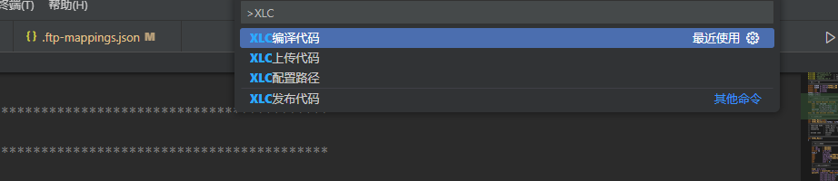

使用说明
CTRL+SHIFT+P



- XLC配置路径 必须首先运行**XLC配置路径**,配置本地和服务器上的路径
.ftp-mappings.json 在工作区根目录下,以下是示例
```
{
    "localConfig": {
        "src": "src",
        "inc": "inc",
        "mak": "mak"
    },
    "ftpConfig": {
        "host": "10.210.69.20",
        "port": 22,
        "username": "zh2devap",
        "password": "zh2devap",
        "remoteSrc": "/home/zh2devap/wfview/dev/mm/src",
        "remoteInc": "/home/zh2devap/wfview/dev/mm/inc",
        "remoteMak": "/home/zh2devap/wfview/dev/mm/mak03",
        "compilePath": "/home/zh2devap/wfview/dev/mm/mak03",
        "deployPath": "/home/zh2devap/wfview/prod/mm/sh",
        "compileTXCommand": "cd /home/zh2devap/wfview/dev/mm/mak03 && ./make.sh",
        "compileBATCommand": "cd /home/zh2devap/wfview/dev/mm/mak03 && ./make.sh",
        "deployTXCommand": "cd /home/zh2devap/wfview/prod/mm/sh && ./PwMmCopyDev03.ksh",
        "deployBATCommand": "cd /home/zh2devap/wfview/prod/mm/sh && ./BATPwMmCopyDev03.ksh"
    }
}
```


- XLC上传代码:仅上传当前窗口文件
- XLC编译代码:上传inc所有文件,根据当前窗口的代码文件名提取TX_ID或者BAT_ID,将对应的queproc文件,sqc文件,mak文件,以及tx_list.mak,上传完毕后调用编译脚本,但是不发布
编译脚本make.sh如下
```
#!/bin/sh

# 设置环境变量
export DB2CODEPAGE=1208
export DB2INCLUDE=../inc

# 开始编译
echo "Starting compilation at: $(date)"
make -f $1 $2

# 检查编译是否成功
if [ $? -ne 0 ]; then
    echo "Compilation failed at: $(date)"
    exit 1  # 返回错误码，表示失败
fi

# 如果目标文件存在，执行后续操作
if [ -f ./${1} ]; then
    if [ ! -f ../mak04/${1} ]; then
        cp ${1} ../mak04/
    fi

    # 切换到目标目录并再次编译
    cd ../mak04/ || exit
    make -f $1 $2

    # 检查二次编译是否成功
    if [ $? -ne 0 ]; then
        echo "Second compilation failed at: $(date)"
        exit 1  # 返回错误码，表示失败
    fi
fi

# 打印脚本结束时间
echo "compilation completed successfully at: $(date)"

# 重新设置环境变量
export DB2CODEPAGE=1208
```
- XLC发布代码就是将编译后的可执行程序发布到dev环境的运行目录
PwMmCopyDev03.ksh如下
```
#!/usr/bin/ksh
if [ -z "$1" ];then
	echo "没有带参数"
else
var=$3
sleep 1
echo "start end TX..."
PwMmEndOneTx.ksh $1
sleep 1
echo "start copy bnd and queproc"
cp -rp /home/zh2devap/wfview/dev/mm/bnd03/tx$1* /home/zh2devap/wfview/prod/mm/bnd
cp -rp /home/zh2devap/wfview/dev/mm/bin03/queproc$1 /home/zh2devap/wfview/prod/mm/bin
cd /home/zh2devap/wfview/prod/mm/sh
sh bindxmOne.ksh tx$1
sleep 1
fi
```
BATPwMmCopyDev03.ksh如下
```
#!/usr/bin/ksh
if [ -z "$1" ];then
	echo "没有带参数"
else
var=$3
echo "start end BAT..."
PwMmEndOneTx.ksh $1
sleep 1
echo "start copy BAT"
cp -p /home/zh2devap/wfview/dev/mm/bnd03/$1* /home/zh2devap/wfview/prod/mm/bnd
cp -p /home/zh2devap/wfview/dev/mm/bin03/$1 /home/zh2devap/wfview/prod/mm/bin
cd /home/zh2devap/wfview/prod/mm/sh
sh bindxmOne.ksh $1
sleep 1
fi
```